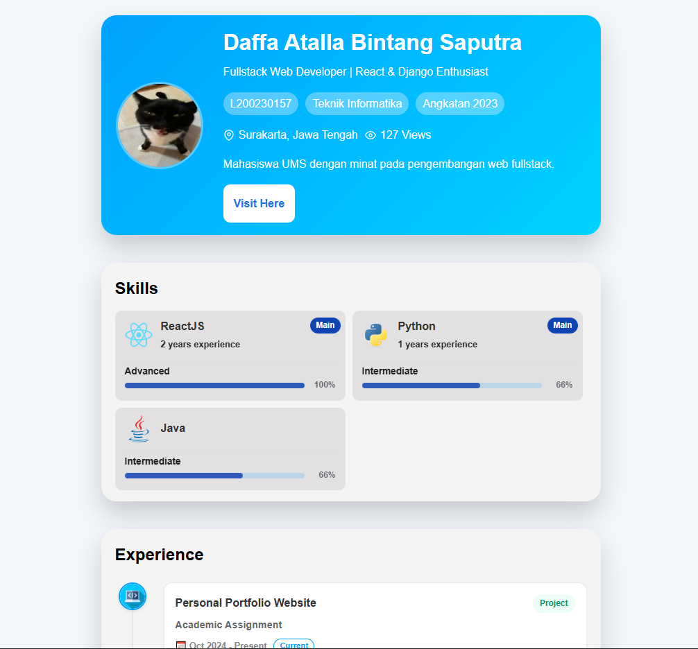

# Personal Portfolio Website

## 1. Deskripsi Aplikasi
Ini adalah website portofolio pribadi yang dibangun menggunakan **ReactJS** dan **Vite**. Aplikasi ini berfungsi sebagai Curriculum Vitae (CV) digital untuk menampilkan profil, keahlian teknis (skills), dan pengalaman saya sebagai mahasiswa Teknik Informatika.

**Fitur Utama:**
* **Konten Dinamis:** Data dikelola melalui file JSON (`dataMahasiswa.json`), sehingga mudah untuk memperbarui isi tanpa mengubah logika komponen.
* **Arsitektur Berbasis Komponen:** Aplikasi disusun dalam komponen modular: `Profile`, `Skills`, dan `Experiences`.

**Teknologi yang Digunakan:**
* ReactJS (Vite)
* CSS3

## 2. Cara Menjalankan Project
Prasyarat: Pastikan **Node.js** sudah terinstal di komputermu.

1.  **Clone repository ini**
    ```bash
    git clone [https://github.com/tif1336/single-page-application-reactjs-untuk-cv-mahasiswa-dafaa157.git](https://github.com/tif1336/single-page-application-reactjs-untuk-cv-mahasiswa-dafaa157.git)
    cd single-page-application-reactjs-untuk-cv-mahasiswa-dafaa157
    ```

2.  **Install Dependencies**
    Masuk ke folder project dan install paket yang dibutuhkan:
    ```bash
    npm install
    ```

3.  **Jalankan Server Development**
    ```bash
    npm run dev
    ```
    Aplikasi akan berjalan di `http://localhost:5173` (atau port lain yang muncul di terminal).

## 3. Link Deployment
Aplikasi versi live dapat diakses melalui link berikut:
[Link](https://coba-react-cv-dfaaa157.vercel.app/)

## 4. Screenshots
Berikut adalah pratinjau tampilan aplikasi:


